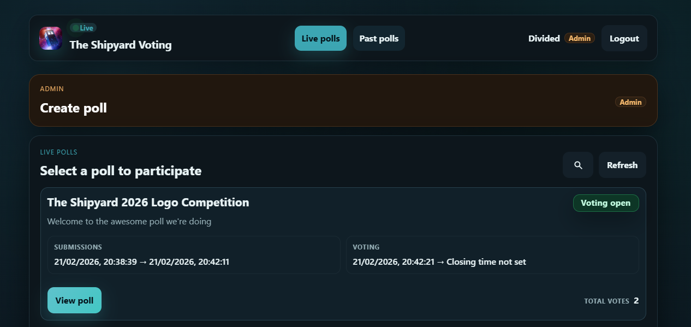

# OpenVoting

OpenVoting is an open-source community voting platform built around fairness, transparency, and abuse-resistance.



## Description

OpenVoting is designed for Discord-first communities that want structured poll lifecycles (submission → review → voting → results), optional anonymity during active phases, and support for both simple and ranked voting.

Core goals:

- Keep voting fair (deterministic shuffle while voting, role/join-date eligibility controls)
- Keep moderation practical (disqualification with reason, admin-only controls)
- Keep user login simple for Discord communities

For how to deploy this yourself, see the [Running with Docker](#running-with-docker) section below and the [Local development](#local-development) section for making code changes.

## Key capabilities

### Poll lifecycle

Polls move through these states:

1. Draft
2. Submission Open
3. Review
4. Voting Open
5. Closed

The submission and voting phases can be configured to end automatically at a set date/time or be manually progressed by an admin. During the review stage after submission closes, admins have a chance to inspect entries, disqualify any that violate rules, and make final adjustments before voting opens.

### Voting methods

- `Approval` voting (select up to max choices)
- `IRV` (Instant Runoff Voting) with ranked choices

IRV is a more expressive voting method that allows voters to rank their preferences. The backend computes winners using the IRV algorithm, which eliminates the lowest-ranked candidates in rounds until a winner emerges with majority support.

### Entry and image handling

- Per-poll field requirements: title/description/image can be Off, Optional, or Required
- Server-side image validation (must be image, size-limited, square, minimum dimensions)
- Derived public image asset generation
- BlurHash-based teaser generation for pre-voting preview mode

### Eligibility and moderation

- Discord guild membership required to authenticate
- Optional admin-role based privileges
- Optional poll-level role requirements and join-date cutoff checks
- Member ban handling
- Entry disqualify/requalify flows with audit metadata

## How to use

This section describes usage from both member and admin perspectives.

### Member flow

1. Open the app in your browser
2. Sign in with Discord
3. Browse live polls
4. Submit entries (when submission is open and allowed)
5. Vote during voting phase
6. Review results in past polls after closure

### Discord one-time login flow

The app supports a Discord slash command login path:

1. In your Discord server, run `/voting`
2. Open the generated one-time login link
3. Confirm sign-in in the web app

The one-time link is short-lived and single-use.

### Admin flow

Admins can:

- Create polls
- Configure poll metadata and field requirements
- Configure submission and voting settings
- Progress poll lifecycle stages
- Disqualify/requalify entries
- Inspect voting tallies during `Review` and `VotingOpen`
- Delete polls and related assets

## Architecture overview

### Backend (`OpenVoting.Server`)

Tech stack:

- ASP.NET Core (.NET 10)
- EF Core + Npgsql (PostgreSQL)
- JWT Bearer authentication
- Azure Blob Storage SDK

### Frontend (`OpenVoting.Client`)

Tech stack:

- React 19
- TypeScript (strict)
- Vite
- React Router
- Vitest + Testing Library

Primary responsibilities:

- Session bootstrap and token refresh
- Poll browsing and interaction UX
- Entry submission and client-side image prevalidation
- Voting UI for Approval and IRV
- Admin controls for lifecycle and moderation

## Configuration

Settings are provided via `appsettings.json` and environment variables.

### Required backend settings

At minimum, configure:

- `ConnectionStrings__Database`
- `Settings__Jwt__SigningKey`
- `Settings__Discord__ClientId`
- `Settings__Discord__ClientSecret`
- `Settings__Discord__GuildId`
- `Settings__BlobStorage__ConnectionString`
- `Settings__BlobStorage__ContainerName`

Common optional settings:

- `Settings__Discord__BotToken` (for slash command registration and guild metadata)
- `Settings__Discord__PublicKey` (Discord interaction signature verification)
- `Settings__Discord__AdminRoleIds__0`, `__1`, ...
- `Settings__BlobStorage__PublicBaseUrl`
- `Settings__Upload__MaxFileSizeMB`

See `OpenVoting.Server/appsettings.json` for schema and defaults.

### Discord app setup

Configure your Discord application with:

- OAuth2 client id/secret
- Redirect URI(s) pointing to your deployment and/or local callback:
	- `https://<host>/api/auth/discord`
	- local dev: `https://localhost:7191/api/auth/discord` (if using default profile)
- Bot token
- Interaction endpoint URL (for slash commands): `https://<host>/api/discord/interactions`

### Local blob storage options

You can use:

- Azure Storage account connection string, or
- Azurite-compatible connection string for local development

## Local development

### Prerequisites

- .NET SDK 10.x
- Node.js 20.x + npm
- PostgreSQL
- (Optional) Azurite for local blob emulation

### 1) Restore dependencies

From repo root:

```bash
dotnet restore OpenVoting.slnx
cd OpenVoting.Client
npm ci
```

### 2) Configure backend settings

Set environment variables or user secrets for the required keys above.

You can start from `OpenVoting.Server/appsettings.json` and override secrets locally.

### 3) Apply database migrations

From repo root:

```bash
dotnet ef database update --project OpenVoting.Server --startup-project OpenVoting.Server
```

### 4) Run the app

The backend will automatically build and run the frontend dev server when you start it, so you only need to start the backend project:

```bash
dotnet run --project OpenVoting.Server/OpenVoting.Server.csproj --launch-profile https
```

The site will start by default on: https://localhost:54196

The Vite dev server proxies `/api/*` requests to the backend.

## Running with Docker

If you just want to run OpenVoting without building locally, use the published docker image:

- `ghcr.io/amyjeanes/openvoting/openvoting:latest`

### Docker run

The app serves on container port `8080`.

```bash
docker run --name openvoting --rm -p 8080:8080 \
	-e ConnectionStrings__Database="Host=<db-host>;Database=<db-name>;Username=<db-user>;Password=<db-password>" \
	-e Settings__Discord__ClientId="<discord-client-id>" \
	-e Settings__Discord__ClientSecret="<discord-client-secret>" \
	-e Settings__Discord__GuildId="<discord-guild-id>" \
	-e Settings__Discord__BotToken="<discord-bot-token>" \
	-e Settings__Discord__PublicKey="<discord-public-key>" \
	-e Settings__Jwt__SigningKey="<long-random-signing-key>" \
	-e Settings__BlobStorage__ConnectionString="<blob-connection-string>" \
	-e Settings__BlobStorage__ContainerName="assets" \
	-e Settings__BlobStorage__PublicBaseUrl="https://<cdn-or-storage-public-url>" \
	-e Settings__Upload__MaxFileSizeMB="10" \
	ghcr.io/amyjeanes/openvoting/openvoting:latest
```

Then open: `http://localhost:8080`

### Docker Compose

Create a `docker-compose.yml` like this:

```yaml
services:
	openvoting:
		image: ghcr.io/amyjeanes/openvoting/openvoting:latest
		container_name: openvoting
		restart: unless-stopped
		ports:
			- "8080:8080"
		environment:
			ConnectionStrings__Database: Host=<db-host>;Database=<db-name>;Username=<db-user>;Password=<db-password>
			Settings__Discord__ClientId: <discord-client-id>
			Settings__Discord__ClientSecret: <discord-client-secret>
			Settings__Discord__GuildId: <discord-guild-id>
			Settings__Discord__BotToken: <discord-bot-token>
			Settings__Discord__PublicKey: <discord-public-key>
			Settings__Discord__AdminRoleIds__0: <admin-role-id-1>
			Settings__Discord__AdminRoleIds__1: <admin-role-id-2>
			Settings__Jwt__SigningKey: <long-random-signing-key>
			Settings__BlobStorage__ConnectionString: <blob-connection-string>
			Settings__BlobStorage__ContainerName: assets
			Settings__BlobStorage__PublicBaseUrl: https://<cdn-or-storage-public-url>
			Settings__Upload__MaxFileSizeMB: "10"
```

Start it:

```bash
docker compose up -d
```

### Important Docker notes

- You still need external PostgreSQL and blob storage (or local equivalents such as Azurite)
- Run EF migrations against your target database before first use
- For local container testing, add `http://localhost:8080/api/auth/discord` to Discord OAuth redirect URIs
- For production, use HTTPS and set:
	- OAuth redirect URI: `https://<host>/api/auth/discord`
	- Discord interaction endpoint: `https://<host>/api/discord/interactions`

## Development workflow

### Backend

Build:

```bash
dotnet build OpenVoting.Server/OpenVoting.Server.csproj
```

Tests:

```bash
dotnet test OpenVoting.Server.Tests/OpenVoting.Server.Tests.csproj
```

Migrations:

```bash
dotnet ef migrations add <Name> --project OpenVoting.Server --startup-project OpenVoting.Server
dotnet ef database update --project OpenVoting.Server --startup-project OpenVoting.Server
```

### Frontend

From `OpenVoting.Client`:

```bash
npm run lint
npm run test
npm run build
```


## Project structure

```text
OpenVoting.Server/         ASP.NET Core backend API
OpenVoting.Server.Tests/   NUnit tests for backend
OpenVoting.Client/         React + TypeScript frontend
charts/openvoting/         Helm chart for Kubernetes deployment
terraform/                 OpenTofu infrastructure definitions
```
